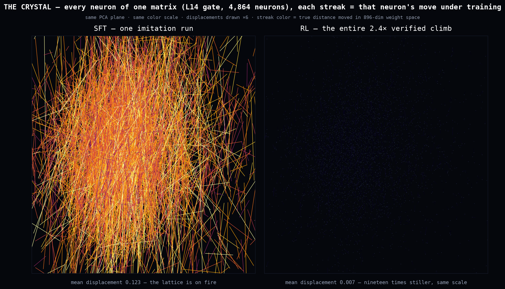

# llmopt



*One SFT run vs an entire overnight verified-RL climb — same matrix,
same scale, each streak a neuron's move. Closed-system RL edits the
policy, not the mind ([RESULTS](docs/RESULTS.md): weight anatomy;
the climb's solve gains are real, its validity headline was partly
a reward hack — also in RESULTS, because that's the deal here).*

LLM inference + training optimization lab. Small, readable implementations of the tricks that make local inference fast — each benchmarked and verified greedy-equivalent against the eager baseline.

## Highlights

**The lab, current state (2026-07-13)** — three threads on top of the
engine below. (1) **Step-level expert iteration** (the founding goal,
LIVE): the 0.5B emits one *verified rewrite* per call — its unit of
generation is an oracle-checked derivation step — trained on
engine-replay + on-policy chains with a promote/rollback gate
(`scripts/expert_loop.py`, ledger in `docs/LOOP-LOG.md`; rounds 2/3
one-shot 13→19/30, step validity 0.5→1.0%; round 4's data-balance
overcorrection rolled back — honestly logged). THE ARENA
(`scripts/arena.py`) streams engine-vs-model showmatches with oracle
verdicts; its finding drove the current data round: the model's
misses are *arithmetic* (signs, unreduced chain-rule constants), not
structural. (2) **Physics rungs, zero chemistry**: a variational
ground-state engine (`llmopt/quantum/ground.py`, TFIM + exact-diag
oracle; HVA hits 0.69% error at criticality with 6 params, beating
depth-4 hardware-efficient ansatze) and an ODE engine that
subcontracts its integrals to the house integral engine — 75/75
parity with `sympy.dsolve`, algebra-path wins on constant-coefficient
2nd order. (3) **Mac/MLX training kernels**: Liger-style fused
cross-entropy (`train/fused_ce.py`) — at 16k tokens 13.5GB vs 38GB
peak AND 1.6× faster (the memory wall flips the sign); population
LoRA training (`train/population.py`) recorded as an honest null at
0.5B shapes (MLX saturates at one adapter's batch).

**The derivation engine, core result (2026-07-11)** — oracle-verified
integration search, every claim raced out-of-sample (`docs/RESULTS.md`
for the measurement-by-measurement history): same-seed L5
**42% → 95.6%** (autopsy-derived rules + node-cost work: killing a
heurisch call in the verifier bought ~2000x cheaper edges, which
bought beam width 3). Production `solve()` is a two-brain system
routed per problem by a learned dispatcher (root features + rule-fire
syndromes → syndrome policy vs markov prior;
disagreement-oversampled labels): three consecutive out-of-sample
router wins over both pure brains, latest **144/150 @ 344s vs 526s
(policy) / 469s (markov)**. House law, the FA Law: *verified speed
is intelligence* — at fixed wall, cheap nodes convert to solves.
Nulls with mechanisms along the way: two prior re-mines regressed
(race merged priors before adopting), a pure-L5 DAgger round
regressed (don't skew corrections entirely to the failure domain),
dispatcher v1 degenerated on imbalanced labels (fix the farm, not
the net).

Qwen2.5-3B-Instruct fp16, single prompt, greedy, 150 new tokens (`scripts/bench_lookup_static.py`):

| Config | tok/s | Speedup |
|---|---|---|
| static KV cache, eager | 23.3 | 1.0x |
| + CUDA graphs (`torch.compile` reduce-overhead) | 71.2 | 3.1x |
| + prompt-lookup w/ fixed-shape verify blocks | 150.1 | 6.4x |
| + longer draft (num_draft=16, max_ngram=4) | 156.7 | 6.7x |

All configs produce token-identical output to eager greedy decoding.

Hyperparameter sweep (`scripts/sweep_lookup.py`): draft length dominates, ngram size barely matters. Under CUDA graphs a rejected draft token costs almost nothing, so longer verify blocks win even at ~15% accept rates.

The full stack composed (`scripts/bench_stacked.py`, `decoding/stacked.py`): radix prefix reuse + REST-style datastore drafting + prompt-lookup + CUDA graphs in one engine. Same Qwen2.5-3B, ~3.4k-token shared document + 4 questions, 100 new tokens each. First round: 1.9–2.4x over eager greedy (prefill collapses to the question suffix). Second round, with the datastore drafting from round-1 generations: **8–17x** — forward passes drop from ~80 to 7–19 as accept rates hit 81–100%. Two of eight requests flip an fp16 near-tie (eager logit margin ≤ 0.016); the rest are token-identical to eager greedy.

Tree verify vs linear lookup (`scripts/bench_tree_verify.py`, same model/prompt, eager): vanilla 23.7 tok/s → linear prompt-lookup 57.3 (2.4x) → tree verify 49.8–50.0 (2.1x) at 2/4/8 candidates. Honest negative: extra candidates add tree nodes faster than acceptances (accept rate 24% → 11% as width grows), so multi-candidate verify loses to the single best candidate on this workload. The one linear-lookup "divergence" is an fp16 near-tie (eager margin 0.0156 ≤ 0.02); tree verify is token-identical at every width.

Distilled-draft speculative (`scripts/bench_distilled_draft.py`, Qwen2.5-3B target + Qwen2.5-0.5B draft, eager): logit-KD LoRA (r=16, fp32 KD — fp16 Adam NaN'd, loss 0.49→0.20) on the target's own generations lifts accept rate 49.8% → 52.4% and tok/s 19.2 → 19.6. Honest negative: both lose to plain greedy (23.5 tok/s) — an eager 0.5B draft costs too much per token relative to a 3B target on one GPU; the win requires a cheaper draft (CUDA-graphed steps or a much smaller head).

Quantized-KV decode attention (`scripts/bench_kv_quant_decode.py`, fused int8/int4 split-K kernels, RTX 3080): roofline says 2x/4x from halved/quartered KV bytes; measured at T=262k is int8 ~1.6–2.3x and packed int4 ~1.7–2.5x (max|err| 1e-4 / 1e-3) — the int4 nibble unpack goes instruction-bound, so it never doubles int8. Below T≈64k a ~75 µs launch/merge floor swallows the bandwidth win entirely. Dequant-then-attend loses 5–10x (the extra HBM trip).

RULER long-context eval (`scripts/eval_ruler.py`, chunked prefill — one-shot 20k-token SDPA prefill OOMs on 10GB): Qwen2.5-3B-Instruct scores 100% on NIAH single/multi-key and variable tracking at every length tested, through 34k tokens — *past* its claimed 32k window. Ceiling result: these are RULER's easiest task families; finding this model's cliff needs harder variants (more hops/distractors), not more length.

MLX (Apple silicon), Qwen2.5-3B-Instruct 4-bit, same prompt (`scripts/sweep_lookup_mlx.py`): greedy 56.9 tok/s → prompt-lookup 63.1 tok/s (1.1x, num_draft=5). The same generic loop runs unchanged and stays token-identical; the gain is smaller because MLX has no per-step launch overhead for drafting to amortize, so shorter drafts win.

Metal split-K decode attention (`kernels/metal.py`, M3 Pro): two-phase split-K (exp2-domain softmax, float32 partials) ties `mx.fast.scaled_dot_product_attention` at T=32k (440 vs 443 µs) and beats naive softmax@V 1.8x; the GQA variant beats a per-head loop ~3x. Found en route: the old bench harness timed MLX's lazy graph construction, not the GPU — every earlier Metal number was an artifact (`mx.eval` every timed iteration). Honest negative: group-shared K/V reads for GQA — the standard CUDA lesson — are ~10% *slower* on M-series; the shared last-level cache already dedupes duplicate reads.

MoE expert pruning by router stats (`scripts/moe_router_stats.py` + `scripts/eval_pruned_moe.py`, Qwen3-30B-A3B-4bit, mathgen symbolic eval): routers are strongly domain-biased (math-vs-prose keep-set Jaccard 0.14–0.51). Masking experts the router never picks on math (**"ever selected"**, 61% kept) holds full accuracy (54.2% vs 53.3%); a count-quantile at 50% kept scores highest (55.8%). Pruning by cumulative router mass @0.99 (42% kept) loses 14 points, and below ~28% kept the model doesn't degrade — it dies (0.0%). Expert pruning is a cliff, not a slope, and probability mass is the wrong knife.

Weight-space reader (`scripts/train_weight_reader.py`, CPU): a ~1M-param neuron-token transformer classifies which function family a tiny MLP was trained on *from its raw weights* at 80.8% (chance 16.7%); permutation-augmented 88.4%. Both on-record predictions were wrong instructively: the neuron-token encoding is already order-invariant (raw never faced the symmetry), and augmentation beat canonical norm-sorting (imposing invariance is brittle under near-ties; teaching it isn't). Corollary now in CLAUDE.md: score weights by *running* them, never by weight distance.

Rotate-then-quantize (`scripts/bench_rotate_quantize.py`, CPU): an orthogonal rotation — same function, every numeric value changed — cuts RTN quantization error 15–20% at 4/3 bits on real Qwen2.5-0.5B weights (down_proj 4b: 0.205 → 0.164); iid-Gaussian control unmoved, planted-outlier control 2.4x. Honest nuance: at 2 bits rotation *hurts* the outlier matrix — with 3 levels, smearing outliers makes nothing representable. The numerically best arrangement of the same weights depends on the bit width.

mathgen calculus recipe reproduced cross-platform (`scripts/train_calculus.py`): Mac MPS 10.7% → 66.3% symbolic accuracy vs Windows CUDA 15.7% → 65.7% — same recipe, one point apart across different hardware, batch composition, and numerics. Limits stay the resistant family on both (≤21%), motivating the derivation-search engine (`search/derivation.py`, HCE + beam chassis landed, primitive move set is the next rung).

Derivation search rung 1 (`search/rules.py` + `scripts/bench_derivation.py`, `scripts/calibrate_hce.py`, CPU): six primitive diff rules ((rule, node) moves, every edge sympy-verified; `doit`/`simplify` demoted from movers to verifier) replace rung-0's omniscient `doit_one` — 20/20 solved on mathgen L1–3 at 6–9 mean plies instead of the degenerate ~1. HCE calibration, the chart chess never had: Spearman ρ(hce, nodes-to-solve) = **+0.685** over 300 on-policy states; worst-HCE quintile solves 27% within 40 nodes vs 89% for the best. HCE v0 genuinely orders states by solve cost, with clear headroom for the learned-eval rung. Honest nulls: the `d_quotient` macro never fires on mathgen shapes (stays off), and integrals/higher-order derivatives are now honest misses until rung 2. On the integration domain — where search genuinely fails — the ordering *sharpens*: ρ = **+0.712** (120 on-policy states, probes capped 400 nodes/120 s), per-quintile solve@40-nodes falling 76% → 4% best-to-worst. Getting that number cost three measured sympy pathologies, each now guarded: the edge oracle must differentiate rather than integrate; `simplify` as a zero-test needs an expand→numeric-screen→simplify ladder (one 18-op state: 1471 s); and the numeric screen must reject residues still carrying `Integral` nodes or `evalf` silently runs 30-digit quadrature (one probe: 2050 s, its timeout alarm swallowed by a broad `except` — probe timeouts are `BaseException` now).

Derivation search rung 2 (`search/rules.py` integration family): u-substitution as a `Subs`-carrier rewrite, stepwise by-parts (inner integrals stay unevaluated), linearity moves — and the roadmap's chart exists: integration solve rate **rises with node budget and saturates below 100%** (L2: 27%→100% from 25→400 nodes; L3 plateaus at 90% with 3 genuine failures). Two findings en route: sympy collapses ∫∫f at construction so `successors()` peels multi-limit integrals (rules stay single-limit), and the edge oracle must *differentiate* the difference, never integrate it — the doit()-based first version burned 31 CPU-minutes without finishing one budget arm; d/dx of an unevaluated Integral is just its integrand, giving equality-mod-constant with zero integrations.

NNUE moment (`search/features.py`, `scripts/train_nnue.py`, `scripts/bench_nnue.py`, CPU): a 20→64→64→1 MLP over cheap structural expression features, trained on 1500 probe-labeled on-policy states (labels = log2 nodes-to-solve; `plies` excluded from features as a label leak), replaces HCE behind the same `eval_fn` interface — swapped, never blended, per the chess discipline. Held-out state ordering: ρ = **+0.937** vs HCE's +0.721 on the same states. The heat that counts — actual beam search on held-out problems — the net **wins or ties all 24 cells** (2 kinds × 3 levels × 4 budgets, n=20): 346/480 vs 331/480, gains concentrated at mid budgets where ranking decides beam survival; at 200 nodes it solves 120/120 vs 117/120. Total cost: ~90 minutes of CPU labeling and seconds of training.

Depth-vs-breadth sweep (`scripts/bench_ksweep.py`, random pruning so move *choice* quality is factored out): at equal node budget, k=1 × 3 restarts — "synthesized breadth" — beats every fixed width and full enumeration in aggregate (**264 vs 254 (k2) vs 234 (k3) vs 219 (full) of 360**), dominating the mid-difficulty band (diff L2@50: 18/20 vs full's 7/20). Two honest boundaries: a single k=1 dive plateaus flat with budget (one deterministic line either hits or never will — restarts convert budget into coverage), and full breadth still wins the semantic-choice regime (int L3@100: 15/20 vs 10/20) where the *right* child must survive pruning — exactly where the trained proposer's +3-over-random edge lives. The two results together motivate entropy-gated adaptive k (spec'd).

Move proposer (`search/proposer.py`, `scripts/train_proposer.py` on the RTX 3080 via SSH, `scripts/bench_proposer.py`): the 0.5B LoRA-SFT'd on 1,429 verifier-approved winning-path (state, legal moves, choice) rows — 3 minutes of GPU — lifts move prediction 50%→67.3% top-1 and 95.7%→**99.7% top-3**. In the 5-config race (n=15/cell, budgets 25–200, both kinds), **prop3+hce wins: 288/360 vs full enumeration's 264/360**, with the controls separating the mechanism: random-k3 pruning alone is +13 (depth beats breadth at tight budgets), the model's judgment is +11 more, concentrated in semantic-choice cells (int L3: 48 vs 40). Honest stings: `prop3+nnue` collapses to 6/15 at int L3@200 — stacked inference exceeds the 300 s/search wall (at high budgets, spend wall-clock on nodes, not ranking) — and the LLM ranker costs up to 1359 s/cell vs 20 s eval-only, motivating policy distillation into features (spec'd). Roadmap #1 ("Stockfish for math") is complete: primitive rules → HCE → calibration → NNUE → policy-guided pruning, every rung measured. Bench parallelism (`search/parallel.py::pmap`, `--jobs`): 3.1× on a small table at 404% CPU, identical outputs to serial.

Adaptive-k, first pass (`scripts/bench_adaptive.py`, entropy-gated branching): pre-registered null at T=1.0 — adaptive scored 268/360, statistically shadowing full enumeration (265) while fixed prop-k3 won (288, reproducing its champion total on the same seeds). The instrument said why: the H-decile histogram never left the top bins — the proposer's softmax at T=1 is flat *everywhere*, so the gate never gated (mean-k pinned 4.4–4.9). Calibration on train-split states found the cure: at **T=0.1** normalized entropy spreads over the full [0,1] range (mean 0.36, σ 0.345 vs σ 0.234 squashed at ceiling for T=1). Ranking well (top-3 99.7%) and knowing *when you're unsure* are different skills. The T=0.1 re-race settled it: **adaptive entropy-gated k is the new champion — 300/360 (83.3%)** vs fixed prop-k3's 288, k1×3-restarts' 267, and full enumeration's 265, all on identical held-out problems. The gate self-organized by regime exactly as designed: mean-k ≈ 3.0 on differentiation (hedging), 1.08–1.5 on integration (confident single-line dives), 60/60 on int L2 where full enumeration scored 47. Confirmed at n=30: 593/720 (82.4%) vs fixed-k3's 560/720, with one honest asterisk — int L3 flips to fixed-k3 (98 vs 88): at the hardest level adaptive's mean-k 1.14 overcommits and width hedges better. One measured softmax temperature turned a pre-registered null into the strongest LLM-guided engine in the repo — the depth-is-the-game and breadth-can-be-synthesized hypotheses (Artin's), fused by their own confidence signal.

Markov ambush (`scripts/markov_prior.py`, `scripts/bench_markov.py`): a rule-bigram count table built from the same winning paths — zero training, zero inference cost — ties the fine-tuned 0.5B at top-3 offline (99.7% = 99.7%) and then **beats it in-search: 293/360 vs the LLM's 288**, running the full race in ~35 CPU-minutes vs ~6 GPU/MPS-hours. The proposer's +11-over-random pruning value was almost entirely rule *grammar*; grammar fits in a dictionary. Standing above it: only adaptive-k (300). The Markov-confidence variant answered why — honest regression: **markov-adaptive 282**, mean-k pinned ~4.1–4.6 because rule-level counts give identical scores to same-rule candidates (artificial ties → flat entropy → the gate never dives). The clean split: *ranking moves is grammar and fits in a dictionary (293); knowing when you're sure needs per-node discrimination, and that's what the 0.5B is actually for (300).* The GPU buys confidence, not choice.

Restart-diversity: golden-angle (low-discrepancy) orderings vs iid — 90 vs 87 of 120, cells contradicting (wins int L3 7-4, loses int L2 12-15): no significant effect at 3 restarts, same asymptotic-only conclusion as the Luby result below. Restart-schedule null (`scripts/bench_luby.py`): Luby ties equal-thirds exactly, 269 = 269 of 360 — with the loss/win pattern inside (Luby's short early slices lose tight budgets, its long late slices win big ones) confirming the theory's fine print: Luby's optimality is asymptotic in restart count; at 3 restarts the schedule is a free choice.

Two closing measurements (2026-07-07 night): the mined highway macro `d_const_factor` (promoted by 14.8% winning-path traffic, scripts/mine_highways.py) is the first macro to earn its slot — diff@50 solve rate 40/90 -> 52/90 with ~1 fewer mean plies — where the textbook-endorsed, zero-traffic `d_quotient` had failed; promotion-by-traffic beats promotion-by-convention. And the first-ever width ablation shows `width=8` (unquestioned since rung 0) was wrong: at fixed node budget width=2 dominates (50/60 vs 36/60 on the hard cells) — the depth thesis again; every posted leaderboard number is internally comparable but absolutely undersold.

**Final leaderboard: adapt-LLM @ width=2, k_max=3, +mined-macros — 343/360 (95.3%), the all-time record** — exactly the config `llmopt.search.engine.solve()` ships (the audit raced the facade default and found the last +6 in the highway macro). Prior: (k_max=6 was sized for the width-8 world; right-sizing it to the narrow beam added +9 — the racing arc reads 265 → 300 → 316 → 328 → 337, every step a measured insight, same rules/model/problems throughout). Previous: **adapt @ w2, k_max=6 — 328/360 (91.1%)** (11 perfect-sweep cells; the day started at 73.6%). The dictionary's run stands at 316: the width dividend lifts everyone (+28 LLM, +23 markov), but confidence keeps its premium at every width (+12 at w2, +7 at w8) — grammar is cheap, depth is the game, knowing-when-you're-sure is what the network is for. **Intermediate record: markov3 @ width=2 — 316/360 (87.8%).** The width dividend compounded on the bigram dictionary (+23 over its own width-8 run, +16 over the LLM-guided champion's 300): the all-time-best engine on the held-out races is six hand-written rules, a rule-bigram count table, k=3 pruning, and a width-2 beam. Zero neural networks, ~35 CPU-minutes for the full table. Refinement of the day's thesis: the GPU buys confidence, but *width is a partial substitute for confidence* — at width 8 you must know which line to trust; at width 2 the beam hedges just enough that grammar + depth carries it. The field completed at width 2: **adapt 328 > k3prop 318 > markov3 316** — the adaptive gate is worth +10 over fixed-k in a fully fair fight, and the podium spread (12 problems, dict-to-best-LLM) versus the search-design spread (~55, day-one baseline to podium) says search wisdom bought ~5x what model intelligence bought.

Sampled edge verification (spec O2, `verify_p`): intermediate edges pay the oracle with probability p (deterministic per child key), while every reported solution replays its full path through the complete oracle first — sampling can waste search but never emit a wrong answer (a `corrupted` counter proves it: zero across all benches). Measured at p=0.1: **1.65× wall clock, byte-identical tables**. Honest context: the spec hoped for 3–5×, but the earlier oracle guards had already removed most of the verification tax — rule application and eval are now the cost floor.

Absorbing-Markov value (`scripts/markov_eval.py`): bucket states by coarse structure (unsolved-count, ops-quartile, node kinds), estimate P(solve|bucket) from fast probes, use −P(solve) as the eval — beats hand-tuned HCE **94 vs 89** on the hard cells (7 of 8 won or tied; diff L3@50: 15/15 vs 12/15). The Markov trilogy closes: as *policy* the dictionary beat the LLM (293), as *confidence* it failed structurally (rule-level ties), as *value* it beats the hand-crafted eval. Two of three engine components now have zero-training probabilistic replacements.

Best-first supersedes the beam (`scripts/bench_bestfirst*.py`): a priority-queue frontier with the same markov top-3 guidance beats the width-2 beam 103 v 91 at equal node budgets (asynchrony +12; the transposition table is worth +21 *within* best-first — memory and selectivity are complements). NNUE finally cashes its ρ-advantage in the h-dominated regime: **bf-nnue 113/120**, breaking the int L3 plateau (11/15 → 13/15) every beam config had called a rule-coverage ceiling.

The autopsy ladder (`scripts/autopsy_int.py`): run the champion at generous budget, dump every failure with its death state, classify, implement the top family, re-race same seeds. Four operator rules fell out — `i_cyclic` (exp·trig closed forms: the winning step is algebra on the equation I = f − I, outside the rewrite space), `i_unprod` (reverse product rule), `i_ansatz_exp` (undetermined coefficients), and **`i_linear_basis`** (bidirectional search collapsed into linear algebra: d/dx is linear, so meet-in-the-middle over answer shapes is one matrix solve — subsumes the other three, the original euler ceiling, and the i_usub showcase). Ladder: int L3 28→**30/30**, L4 12→**19/30**. Along the way: mined priors structurally suppress new rules (unseen rule scores 0.0 → top-3 guillotine; fixed with median smoothing) and sympy pathology #6 (simplify's default `doit` evaluates inner Integrals).

**Hybrid record: 349/360 (96.9%), confirmed 694/720 at n=30** (`scripts/bench_hybrid.py` + `bench_control.py`) — markov ranks, the 0.5B only entropy-gates k. Decomposed honestly: the autopsy rules lift the dict 316→334 alone; LLM confidence adds **+15 on identical ranking and rules**, the largest confidence premium measured. Thesis, final form: choice is grammar (free); confidence is the GPU's entire job.

The self-teaching curve, end to end (`scripts/tabula_rasa_r*.py`, `bench_frontier.py`): the from-scratch lineage (random search → train on own wins → repeat; only the verifier given) goes r0 112 → r1 138 (**+26**; both L4 cells ~double) → r2 139 (+1); the mature lineage's curve point tied 40 v 40 at its own round 2. **Self-teaching is a step function to the reachable-set ceiling — the whole climb happens in one round, from either starting point; only new operators move the ceiling.** Booked nulls around it: UCB engine-bandit (bf-nnue dominates every cell, arms form a total order), annealed best-first (greedy 112 > T=1 108 > T=5 103 > T=25 97 — eval quality substitutes for temperature), and prior hygiene (mining random-search wins dropped the control 334→300; a champion-harvest re-mine restored 335 — the verifier guarantees paths are right, not wise).

mathgen grew ten oracle-verified kinds in a day (`ntheory.py`, `multivar.py`, `mechanics.py` — Euler–Lagrange consistency asserted at build time — and `proofs.py`: induction as two sympy obligations, statements true by construction), plus specs for series/inequalities and the Lean rung. The L4 residual is timeout *economics*, not capability (10/11 failures are walls): 2s per-rule time boxes measurably hurt (22→16 — on monsters the expensive rules are the winning rules), profiling found no single stall (death by total work), and the structural fixes — lazy expansion (apply rules in prior order, stop at k: timeouts 9→1) and commutator-structure pruning (partial-order reduction: never generate the non-canonical ordering of commuting moves) — are the active thread.

The ceiling moves (`euler` move, from the complex-numbers thread): ∫sin²x had **no derivation in the real-form rule set** — a provable operator-closure ceiling, the hard limit in the is-there-a-limit-to-self-teaching question. One representation-change move (trig → complex exponentials, gated to trig-under-Integral) and the derivation exists — through *entirely pre-existing rules*: `euler → i_sum → i_const_factor → i_usub(u=2ix) → i_table → subs_eval`. Self-teaching optimizes within the reachable set; new operators enlarge it. Both mechanisms, now measured in one repo.

Task arithmetic on LoRA task vectors (`scripts/task_arithmetic.py`, `scripts/task_composition.py`, 0.5B): the calculus adapter transfers **completely** across parent weights — grafted onto the base (non-Instruct) model it scores 66.3% vs the donor's 66.0% (base alone: 0.3%). Scaling peaks at exactly λ=1.0. The rest is honest failure: negation is a lobotomy (0% math, 6.2M perplexity), the vector carries a format-forcing component that costs 16x prose perplexity even at λ=1, and adding two single-skill adapters annihilates both (98%/89% alone → 1.3%/4.7% added; retention bar was 90%). At this scale and training intensity, plain addition doesn't merge skills — the TIES-style variants exist for a reason. Also an honest null: fusing swiglu into mlx-lm's MLP is +0.1% end-to-end at batch-1 decode.

## What's inside

| Subpackage | Implemented | Roadmap |
|---|---|---|
| `search/` | the derivation engine: rule moves (diff/int/limit families incl. `i_linear_basis` meet-in-the-middle, `i_cyclic`, euler rewrite), beam + best-first w/ transposition table, HCE + NNUE evals, markov bigram prior, syndrome policy (production brain), learned dispatcher router, magic dead-state pruning (Risch-certified), sampled edge verification — 356/360 record, L5 100%, L8 37/40 | L9 / adversarial generation |
| `quantum/` | variational ground-state engine: TFIM builder, exact-diag oracle, RY+CZ and HVA ansatze, param-shift grads, token-list structure executor; T-count/ZX engine (pyzx rungs 0-6) | syndrome-policy port to ZX |
| `decoding/` | prompt-lookup, speculative (greedy + rejection sampling), backend-agnostic lookup loop (pluggable draft source), REST-style retrieval datastore (suffix index over past generations, longest-suffix match + next-token vote), sampler pipeline (top-k/p, min-p, DRY, mirostat v2), regex-constrained FSM decoding, tree verify (multi-candidate lookup drafts, tree attention), Medusa heads (Medusa-1 training + tree-verified decode), chunked prefill + continuous batching engine, self-speculative / LayerSkip (early-exit draft, full-model verify), sampler-aware speculative verify (exact filtered-target distribution), EAGLE-2 (feature-level draft head, confidence-ranked dynamic trees), lookahead (Jacobi fixed-point), quality decoders (verify by target score: top-k / logprob margin), scheduler (priority admission, preemption w/ recompute-on-resume, prefill/decode disaggregation) | — |
| `backends/` | `DecodeBackend` protocol, torch StaticCache + CUDA graphs, MLX (Apple silicon) | — |
| `cache/` | radix prefix KV tree w/ LRU + mid-edge splitting, prefix reuse wired into the batching engine (prefill skips cached prefixes, token-identical output; Qwen2.5-3B, ~3.4k-token shared prefix: 13.8x faster TTFT on warm requests — `scripts/bench_prefix_reuse.py`), paged blocks (ref-counted allocator, block tables, fork + copy-on-write), KV int8/int4 quant (quantized paged store), eviction policies (sliding window, attention sinks, H2O, SnapKV) | — |
| `quantize/` | per-layer ΔKL sensitivity (fake-quant), min-memory bit allocator, Pareto sweep, GPTQ (Hessian error compensation), AWQ (activation-aware scale search), HQQ (lp-robust zero-point, calibration-free), magnitude + 2:4 pruning, low-rank SVD | — |
| `train/` | batched ref-logprob precompute + disk cache, LoRA + DoRA (wrap/freeze/merge), sequence packing (FFD bins, block-diag masks, position reset), preference losses (DPO/IPO/KTO/ORPO/SimPO/GRPO), fused chunked cross-entropy (MLX, never materializes the 152k-vocab logits), population LoRA (K adapters/one frozen base — honest null at 0.5B, banks for tiny nets) | — |
| `eval/` | perplexity, tokens/sec bench, pass@k, bootstrap CIs, equivalence harness, roofline / MFU / arithmetic-intensity model + per-op attribution (analytic FLOPs/bytes per op, memory- vs compute-bound, torch.profiler complement), calibration (ECE), TTFT/TPOT split | — |
| `context/` | RoPE scaling (PI/NTK/YaRN, in-place HF patch), LLMLingua-style prompt compression (self-information scoring, protected spans), RULER-style synthetic long-context eval (NIAH single/multi-key, variable tracking, effective-context-length), gist tokens (bottleneck attention mask, KV compression to gist slots, training step) | — (attention sinks live in `cache/`) |
| `internals/` | logit lens (per-layer KL to final), attention entropy + mean attended distance, activation stats (rms/kurtosis/outliers), linear CKA layer-similarity | — |
| `kernels/` | Metal (MLX): fused RMSNorm (1.7x vs unfused), fused SwiGLU (1.6x), RoPE, split-K decode attention (single-head + GQA, exp2-domain softmax — ties mx.fast SDPA at T=32k), fused int4 dequant-GEMV (1.11x at D=4096, awq-foldable packing), flash prefill v1/v2 (honest losses, autopsied: v2's simdgroup MMA is table stakes, orchestration is the moat), single-query flash-style attention (online softmax — educational; loses to full-GPU GEMV, honestly measured); Triton (CUDA): same four ops (RMSNorm 3.7x vs unfused, 1.5x vs `torch.nn.RMSNorm`; SwiGLU 2.7x; split-K decode attention w/ fused merge, 1.1x vs naive), paged attention over `cache/paged.py` block tables (GQA group shares each K/V read, split-K + merge; 2.7x vs gather-then-SDPA, attends fork/COW-shared blocks in place) + full tiled flash attention (fp16 tensor-core dot, mask-free interior tiles, exp2 softmax, autotuned — 1.4x vs torch fused SDPA, causal, cross-length) | — |
| `moe/` | top-k gated MoE (SwiGLU experts), Switch load-balance + router z-loss, capacity/token-drop, LRU expert offload cache | — |
| `mathgen/` | sympy-verified generators: calculus (7 kinds incl. traced limits), linear algebra (planted eigenvalues via P·D·P⁻¹, verify-not-compare inverses), ODEs (checkodesol-scored, both ICs enforced); contamination-proof splits. LoRA'd Qwen2.5-0.5B: 15.7% → 65.7% symbolic accuracy on unseen problems (differentiation 94-100%, integration 71-97%); step traces lift limits only ~10→16% — the factor step is itself simulation, scaffolding relocates the wall, doesn't remove it | expert iteration (per-step verify) — LIVE, `scripts/expert_loop.py` |
| `codegen/` | compiler-as-oracle (MSVC + LLVM: diagnostics, optimized asm, byte encodings, mangled symbols, program output) and a 7-rung capability ladder, every rung toolchain-scored (predicted asm is assembled, mangled names demangled). 0.5B cold→tuned: encode 0→40%, decode 0→36%, diagnose 76→100%, output 0→8%, O2-asm 0→0% — small models learn *mappings*, resist *simulation* | mangle/lifetime rung benchmark |
| `distill/` | logit-KD (temperature-scaled forward KL) + draft-model distillation (accept-rate lift verified end-to-end), sequence-KD, on-policy GKD (generalized JSD) | — |

## How the fast path works

Prompt-lookup decoding drafts continuations by matching n-grams against the prompt (no draft model needed), then verifies the whole draft in one forward pass. Making that CUDA-graph compatible requires fixed shapes:

- Every decode step feeds exactly `num_draft + 1` tokens: `[last_token, draft..., pads]`. One shape → one captured CUDA graph, replayed every step.
- Pads sit at the highest positions; causal masking means no real query attends them. Pad logits are ignored.
- After acceptance, the StaticCache write pointer rewinds to the true sequence length so the next block overwrites stale slots.

The decode loop itself is framework-agnostic (`decoding/lookup_generic.py` + `backends/base.py`): only Python ints cross the backend boundary. The torch backend lives in `backends/torch_static.py`; `backends/mlx_backend.py` implements the same three methods (`begin` / `step_argmax` / `rewind`) over mlx-lm's trimmable KV cache.

## Install

```bash
pip install -e ".[dev]"
# GPU torch (CPU wheel installed by default):
# pip install torch --index-url https://download.pytorch.org/whl/cu124
```

## Quick start

```python
from transformers import AutoModelForCausalLM, AutoTokenizer
import torch

tok = AutoTokenizer.from_pretrained("Qwen/Qwen2.5-0.5B")
model = AutoModelForCausalLM.from_pretrained("Qwen/Qwen2.5-0.5B", torch_dtype=torch.float16).cuda()

# fast path: lookup decoding over the backend protocol
from llmopt.backends.torch_static import TorchStaticBackend
from llmopt.decoding.lookup_generic import generate_lookup

ids = tok("Summarize: ...").input_ids
compiled = torch.compile(model, mode="reduce-overhead", fullgraph=True)
backend = TorchStaticBackend(model, compiled_step=compiled)
tokens, stats = generate_lookup(backend, ids, max_new_tokens=128, num_draft=16)
print(stats)  # forward_passes << 128 on input-grounded tasks

# quantization: sensitivity -> bit allocator -> Pareto
from llmopt.quantize.sensitivity import measure_sensitivity
from llmopt.quantize.allocator import allocate_bits

seqs = [tok(p).input_ids for p in prompts]
from llmopt.train.ref_logprobs import precompute_ref_logprobs
refs = precompute_ref_logprobs(model, seqs, model_name="qwen2.5-0.5b",
                               cache_dir=".refcache", batch_size=8)
sens = measure_sensitivity(model, seqs, refs, bit_widths=(2, 4))
cfg = allocate_bits(sens, kl_budget=0.05)
print(cfg.avg_bits, cfg.bits_by_layer)
```

## Benchmarks & tests

```bash
pytest                                  # pure-Python parts run without GPU
python scripts/bench_lookup_static.py   # full stacked benchmark (GPU)
python scripts/sweep_lookup.py          # ngram/draft hyperparameter sweep (GPU)
python scripts/sweep_lookup_mlx.py      # same sweep on MLX (Apple silicon)
python scripts/bench_triton_kernels.py  # Triton kernels vs torch (CUDA)
python scripts/bench_prefix_reuse.py    # radix prefix reuse TTFT (GPU)
python scripts/bench_stacked.py         # full stack: radix + lookup + graphs (GPU)
python scripts/bench_tree_verify.py     # tree verify vs linear lookup (GPU)
python scripts/bench_distilled_draft.py # draft KD -> speculative accept rate (GPU)
python scripts/bench_kv_quant_decode.py # int8/int4 fused KV decode kernels (CUDA)
python scripts/eval_ruler.py            # RULER long-context eval (GPU)
python scripts/bench_metal_kernels.py   # Metal kernels vs MLX (Apple silicon)
```

On Windows, `torch.compile` needs MSVC — run benchmark scripts inside a vcvars64 environment (see `scripts/bench_compile.py` docstring).

## Design notes

- Ref logprobs stored as top-k + tail mass (full-vocab for 164×1k×150k would be ~100 GB).
- transformers 5.x StaticCache appends at an internal `cumulative_length` counter; rewinding resets that tensor in-place (`fill_`), CUDA-graph-safe because HF marks it as a static address.
- Allocator assumes ΔKL additivity across layers — approximate; always re-measure the final mixed config end-to-end.
- Fake-quant measures quality only. Real memory savings need bitpacked kernels (HQQ/GPTQ) at deploy time.

## License

MIT
