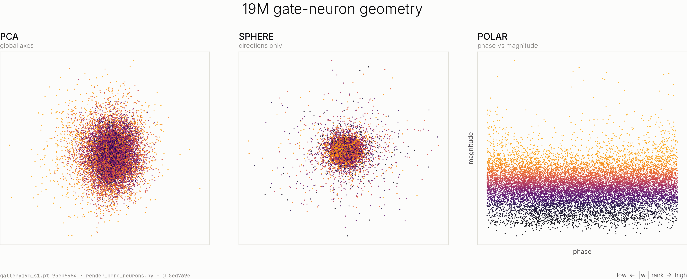
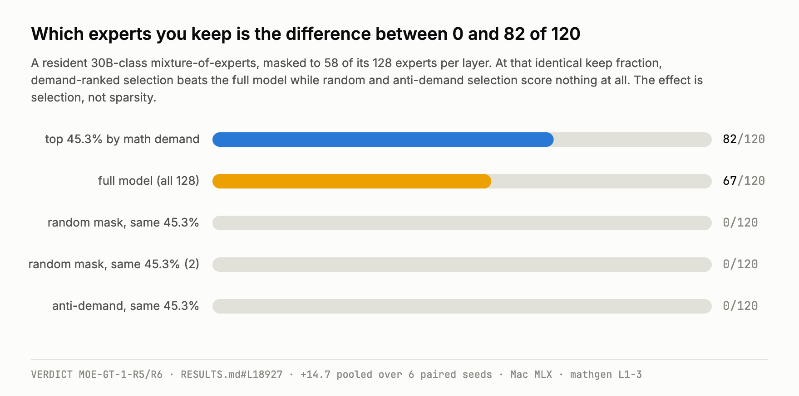
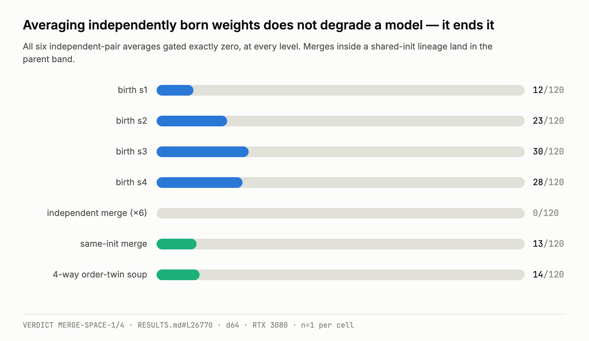
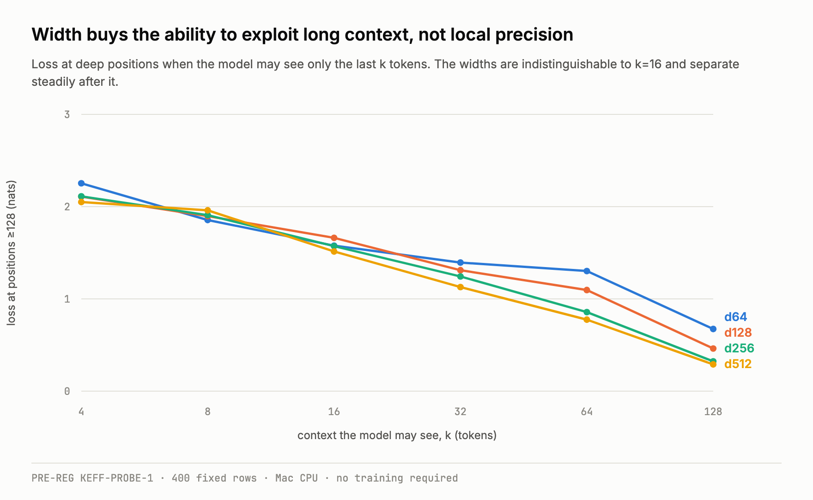
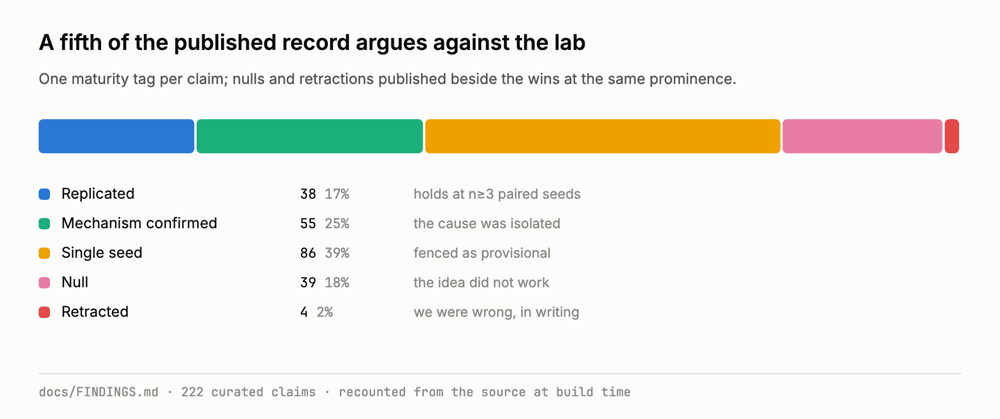

# llmopt

**A mathematics and physics ML lab where nothing counts until an oracle
agrees.** Answers are checked by symbolic equivalence, not string match.
Decoding is proved token-identical to eager greedy. Generated assembly is
assembled and run. Weights are scored by what they compute, never by their
distance to other weights. Every experiment is pre-registered with a
threshold it can fail, and the failures are published beside the wins.

<picture>
  <source media="(prefers-color-scheme: dark)"
          srcset="docs/assets/hero/neurons-19m-dark.png">
  
</picture>

That is every gate neuron in a 19M-parameter model born on this lab's
math corpus — 12,288 rows of weight matrices, drawn three ways: global
PCA axes, directions alone on the unit sphere, and phase against
magnitude. Color is each neuron's magnitude. Nothing in that image was
designed. It is the model, drawn — checkpoint hash and repo commit are
stamped in the footer, so the pixels trace to exact artifacts.

---

## Four results

**Which experts you keep is the difference between 0 and 81 of 120.**

<picture>
  <source media="(prefers-color-scheme: dark)" srcset="docs/assets/web/routing_crest-dark.png">
  
</picture>

Masking a resident 30B-class MoE to the top 45.3% of its per-layer
math-demand experts **beat the paired full model at all six paired seeds** —
80, 82, 81 against 63, 73, 63 at the three registered ones, pooled +14.7
against a +7 bar declared before the run. At the identical keep fraction,
random and anti-demand masks score nothing at all. The effect is selection,
not sparsity — and *why* it happens is still unexplained. Scope: one vehicle,
one keep rule, mathgen L1–3, Mac MLX; the zero-scoring controls ran at their
own seed and are not paired to those arms.

**Averaging independently born weights does not degrade a model. It ends it.**

<picture>
  <source media="(prefers-color-scheme: dark)" srcset="docs/assets/web/merge_space-dark.png">
  
</picture>

Six pairwise averages of independently born models gated **exactly zero, at
every level** — not degraded, dead. Merges inside a shared-initialization
lineage land in the parent band instead, and that holds at three paired seeds
even when the two models share no optimizer step and no data order. The basin
is chosen at initialization; everything after is basin-local.

**Effective context is architecture-bound, and width does not fix it.**

<picture>
  <source media="(prefers-color-scheme: dark)" srcset="docs/assets/web/effective_context-dark.png">
  
</picture>

The training floor descends monotonically across an eight-fold width ladder
and never approaches the corpus entropy at k=32 — the whole ladder buys about
one token of effective context. Swapping in the opposite inductive bias, a
selective state-space model, did not cross the wall either, though that arm
gated only 2 of 120 and so is a weak control. The wall appears to belong to
the diet.

A truncation probe on the same checkpoints then found something the
training-loss average could not see: at deep positions every width improves by
about a nat as context grows from 16 to 128 tokens, so the long-range
dependency is real. Its *second* registered bar — that wider models separate
more as context grows — **did not fire**: the gap is negative at k=8 and
narrows again at k=128.

## The record argues with itself

<picture>
  <source media="(prefers-color-scheme: dark)" srcset="docs/assets/web/honesty_ledger-dark.png">
  
</picture>

<!-- llmopt:generated honesty-ledger:start -->
The 217 curated claims in FINDINGS by maturity: 38 replicated, 54 mechanism-confirmed, 82 single-seed, 39 null, 4 retracted.
<!-- llmopt:generated honesty-ledger:end -->

A fifth of the published record is negative. Nulls and retractions sit beside
the wins at the same prominence, because a ledger that only records successes
cannot be checked. Each claim carries exactly one maturity tag and its scope
fences — device, seed count, format, regime — and those tags are part of the
claim, not optional reading. The counts above are recounted from the source
every time the figure is built.

Start with the [curated findings](docs/FINDINGS.md), organized by evidence
maturity rather than chronology. The [glossary](GLOSSARY.md) defines the
vocabulary; [RESULTS](docs/RESULTS.md) is the living append-only ledger every
claim resolves to; [REPRODUCE](docs/REPRODUCE.md) is the walkthrough.

## What is built

```bash
pip install -e ".[dev]"          # core: torch, numpy, sympy
pip install -e ".[figures,lake]" # optional: plotting, Parquet result lake
```

**Research instruments.** [`search/`](llmopt/search/) — symbolic derivation
search with explicit rewrite rules, learned evaluators, transposition memory,
and a verified ZX path for circuit reduction. [`mathgen/`](llmopt/mathgen/) —
seeded generators for calculus, linear algebra, ODEs, mechanics, and proofs,
with symbolic checks built into generation. [`moe/`](llmopt/moe/) — routing
anatomy: demand ranking, keep-sets, router masking, expert surgery.
[`weightspace/`](llmopt/weightspace/) — predicting what a network computes
from its parameters. [`quantum/`](llmopt/quantum/) — model-Hamiltonian
ground-state instruments. [`lab/`](llmopt/lab/) — the adopted instrument
layer: the standard gate, the fork-isolated oracle, the checkpoint catalog,
merge operations. [`runs/`](llmopt/runs/) — run receipts, completion
markers, trajectory instruments, the Parquet result lake.
[`figures/`](llmopt/figures/) — the validated palette and both figure
renderers, reading every published number from `docs/figures.json`.

**Training and numerics.** [`train/`](llmopt/train/) — closed-system births,
controlled diets, LoRA, preference objectives.
[`common/`](llmopt/common/) — device selection, string-seeded RNG,
checkpoint IO.
[`intmath`](llmopt/intmath.py) — exact integer primitives, the arithmetic
behind bit-identical cross-machine replay. [`quantize/`](llmopt/quantize/) —
sensitivity probes, closed-form bit allocation, packed integer artifacts.

**Inference and systems.** [`decoding/`](llmopt/decoding/) — speculative and
prompt-lookup decoding, sampler pipelines, constrained decoding, tree
verification. [`cache/`](llmopt/cache/) — radix prefix tree, paged blocks, KV
quantization, eviction. [`kernels/`](llmopt/kernels/) — hand-written Metal and
Triton kernels **with the benchmarks they lost**.
[`codegen/`](llmopt/codegen/) — assemble the prediction, run the program.

## Reproduce

```bash
RJOB_LOCAL=1 python -m llmopt.reproduce gravmoe-rb1
```

`PASS` means the final training-trajectory digest exactly matches the
committed pin. A 1000-step integer birth replays **bit-identically** on a
second machine, and a 200-step birth is trajectory-identical across Mac CPU,
an RTX 3080, and an external lab's independent C++ engine.

Trajectory agreement is not oracle correctness: it certifies the pinned weight
path and teacher-forced readouts. Free-run symbolic scoring additionally needs
diet row text that is not committed, so artifact-backed arms run in an
explicit trajectory-only mode. `python -m llmopt.reproduce --list` shows the
registry.

## What remains uncertain

**The crest has no mechanism.** Why masking a deployed MoE to its demand
coalition beats full width on mathematics is unexplained. The two quantities a
keep rule optimizes — coverage and recall of demanded experts — were measured
not to predict even the *sign* of the effect.

**The best current candidate is interference removal**, reachable either by
the demand mask or by deleting a named 80-expert carrier population, 1.3% of
the bank. Both forms replicated at three fresh paired seeds, with the router
measured over-inclusive at the carriers' rank class. A same-night control
complicated it: a matched-size random fill resurrected a dead core about as
well as the verbal-branch fill, but that random pool was itself ~45%
verbal-branch experts. Fills that exclude the verbal branch score 0 and 7 of
120 against 16 to 55 for fills that include it. So the verbal population is
necessary and recall does not organize it; what is *sufficient* is unmeasured.

**The calibration-free packing law has a measured boundary.** It holds on
at-capacity house crystals and does not transport to Qwen2.5-0.5B, where
max-anchored and calibrated grids exploit weight-tail structure the house
crystals lack. Both sides of that boundary are `n=1`.

**Many comparisons remain single-seed and device-scoped.** The maturity tags
say which. Cross-device gate comparisons are forbidden outright, and the
figures above carry their own device and seed count.

**Reproduction stops short of self-contained oracle scoring**, because the row
text cannot currently be shared. The public artifact proves the trajectory and
the teacher-forced readouts, and says so.

## Citing

Name the exact commit SHA and the exact verdict entry in
[`docs/RESULTS.md`](docs/RESULTS.md) that supports the claim. The ledger is
living, so an unpinned citation is not reproducible. Repository metadata is in
[`CITATION.cff`](CITATION.cff).

The [board](docs/BOARD.md), [theory map](docs/THEORY.md), [idea
ledger](docs/RIFF-LEDGER.md), [handoffs](docs/handoffs/), and
[machine-readable index](docs/results-index.jsonl) are living surfaces.
Charter: mathematics and physics only.

Licensed under [Apache-2.0](LICENSE).
